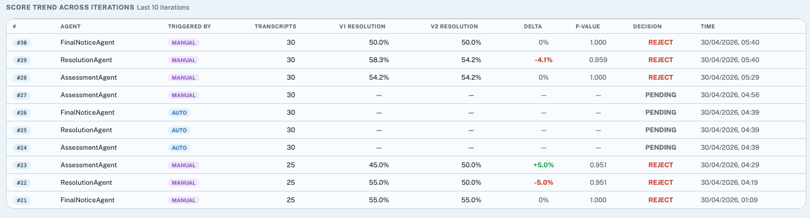
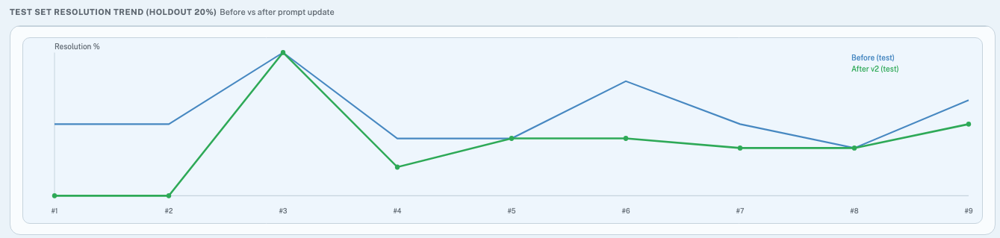

# Evolution report (pipeline metrics + charts)

This document explains how to generate the **evolution report**: a self-contained **JSON** summary and **HTML** dashboard of self-learning pipeline runs, aligned with the admin UI where possible.

## What you get

| Output | Path (default) | Purpose |
|--------|------------------|---------|
| JSON | `artifacts/evolution_report.json` | Machine-readable series per agent, including a `convergence` block matching Agent Analytics |
| HTML | `artifacts/evolution_report.html` | Charts (Chart.js via CDN); open in a browser |

The generator is `scripts/evolution_report.py`.

## Prerequisites

- **Python 3** with project dependencies installed (from repo root: `pip install -r requirements.txt` or your virtualenv).
- **Environment**: `python-dotenv` loads `.env` from the repo root when using MongoDB (same as the rest of the app).
- **MongoDB path (default)**  
  - `MONGODB_URL` / `MONGODB_DB` reachable.  
  - Reads `eval_pipeline` and `prompt_changes` (for version labels on convergence charts).
- **Artifacts-only path**  
  - No Mongo required.  
  - Point `--glob` at saved `run_doc.json` files (for example under `artifacts/repro-*/`).

## How to run (copy-paste)

From the **repository root** (`project-slaca/`):

### A. Live data from MongoDB (typical)

```bash
cd /path/to/project-slaca
python3 scripts/evolution_report.py --limit 400
```

Outputs go to `artifacts/evolution_report.json` and `artifacts/evolution_report.html` unless you pass `--output-dir`.

### B. Offline from saved repro bundles (no Mongo)

```bash
cd /path/to/project-slaca
python3 scripts/evolution_report.py \
  --source artifacts \
  --glob 'artifacts/repro-*/run_doc.json'
```

### C. Single agent

```bash
python3 scripts/evolution_report.py --agent FinalNoticeAgent --limit 400
```

### D. Include mock pipeline runs (default: excluded)

Same rules as Agent Analytics: mock runs are filtered out unless you opt in:

```bash
python3 scripts/evolution_report.py --include-mock --limit 400
```

### E. Custom output directory

```bash
python3 scripts/evolution_report.py --output-dir ./reports
```

## How to view the HTML report

1. Generate the report using one of the commands above.
2. Open the file in a browser:
   - **macOS**: `open artifacts/evolution_report.html`
   - **Windows**: double-click `evolution_report.html` in Explorer.
   - **Linux**: `xdg-open artifacts/evolution_report.html` or open from the browser (File → Open).

The page loads **Chart.js from jsDelivr**; the machine needs outbound HTTPS once for the charts to render.

## CLI reference

| Flag | Default | Meaning |
|------|---------|---------|
| `--source` | `mongo` | `mongo` or `artifacts` |
| `--limit` | `500` | Max runs fetched from Mongo (when `--source mongo`) |
| `--agent` | *(empty)* | Restrict to one of `AssessmentAgent`, `ResolutionAgent`, `FinalNoticeAgent` |
| `--include-running` | off | When using Mongo, do not restrict to `status: completed` |
| `--include-mock` | off | Include runs detected as mock (run_id / `triggered_by` heuristics) |
| `--glob` | `artifacts/repro-*/run_doc.json` | Glob for `--source artifacts`, relative to repo root |
| `--output-dir` | `artifacts` | Directory for `evolution_report.json` and `evolution_report.html` |

## What the numbers mean (alignment with the UI)

The JSON field `metric_alignment` summarizes this; expanded here for operators.

1. **`convergence` (per agent)**  
   Same construction as **Agent Analytics → convergence charts** (`build_convergence_payload` in `src/pipeline_report_metrics.py`):  
   - Completed runs only, chronological order.  
   - **v1** from `transcript_scores` + `held_out_scores` when possible, else `version_comparison`.  
   - **v2** from `executed_v2_scores` when possible, else `version_comparison`.  
   - **`version`** on each point comes from **`prompt_changes`** when `run_id` matches; otherwise the label falls back to **`run_id`** (common for artifact-only runs).  
   - **Evolution report** uses **all** eligible runs in `convergence.points`. The embedded Agent Analytics UI still uses a **last-10** window for its SVG; the **math** is the same, the **length** of the series can differ.

2. **Train charts (`train_v1_pct`, `train_v2_pct`, deltas)**  
   Same **score-derived** rules as convergence (not the Pipeline “score trend” table alone).

3. **`pipeline_ab_*` (JSON only)**  
   **A/B train** rates from **`version_comparison` only** — matches the **Pipeline** tab “score trend” table (`v1_resolution_rate` / `v2_resolution_rate`).

4. **`test_*`**  
   Same rules as **`GET /api/admin/pipeline/test-resolution-trend`** (stored test fields or recomputed from holdout + executed v2 scores).

5. **Agent Analytics “Prompt Version History” table**  
   That table is driven by **interactions** and prompt-version buckets; it is **not** reproduced field-for-field in this report. Use the admin UI for that table; use the evolution report for **pipeline run evolution** and **convergence-style** trends.

## JSON layout (short)

Top level:

- `generated_at_utc`, `source`, `metric_alignment`, `filters`, `run_count`
- `agents`: map of `agent_name` →  
  - `run_count`, `points` (per-run metrics + `iteration`)  
  - `convergence`: `status`, `points` (convergence series), `baseline_v1_rate`, `plateau`, `stability_band`, etc.

## Train trend for the new version

Trend for all agents at n = 25

Delta~ 0% and Test Set diff: 0




This feels like the resolution is coming to a plateau.

## Implementation pointers

- Script: `scripts/evolution_report.py`  
- Shared metrics / convergence: `src/pipeline_report_metrics.py`  
- Admin reuses `build_convergence_payload` for `/api/admin/analytics/agents` convergence payload.

## Troubleshooting

| Issue | What to try |
|-------|-------------|
| `MongoDB unavailable` | Set `MONGODB_URL`, start Mongo, or use `--source artifacts` with a valid `--glob`. |
| HTML charts empty | Allow network access for `cdn.jsdelivr.net`, or check the browser console for blocked scripts. |
| Convergence `version` equals `run_id` | Expected if `prompt_changes` has no row for that run (typical for offline artifact replays). |
| No adopted points on “Adopted Δ vs version” chart | Only **adopt** decisions are plotted for that chart (same idea as the dashboard). |
